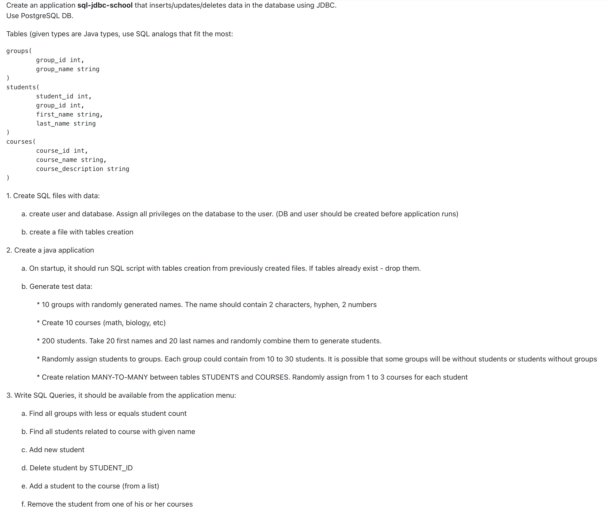
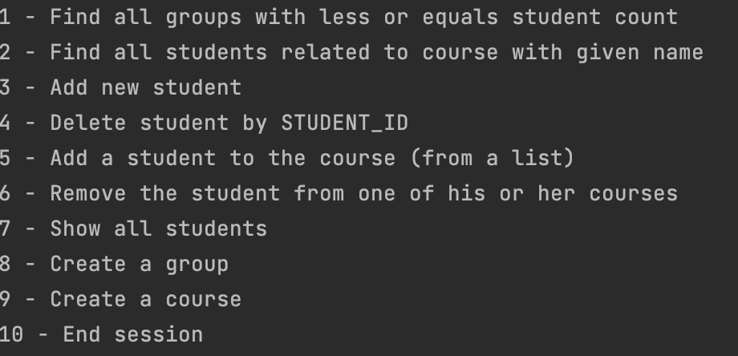
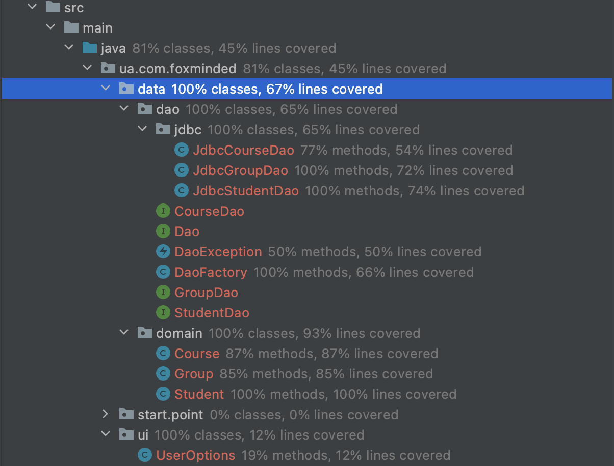

Task 4 - Integer division(LMS link https://lms.foxminded.com.ua/mod/assign/view.php?id=26)

This program allows user store and update data for school using postgres database. 

Program is tested, using JUnit 5. Tested on redis connection, tested work of caches on right get and put operations, on correct work with input values, and tested method for output, calculation and conversions.
1. Technologies that are used:
    1. Java 8
    2. JUnit 5
    3. Maven
    4. PostgreSQL

2. To build project you need  to have IDE Eclipse(download link eclipse https://www.eclipse.org/downloads/) or IntelijIDEA(download link IDEA windows: https://www.jetbrains.com/idea/download/#section=windows, macintosh: https://www.jetbrains.com/idea/download/#section=windows, linux:https://www.jetbrains.com/idea/download/#section=linux), and follow instructions in this videos for IDEA (link https://www.youtube.com/watch?v=3Xo6zSBgdgk), eclipse (link https://www.youtube.com/watch?v=3Xo6zSBgdgk 2:30).
   Also user can build project by maven using next commands:
    1) mvn compile
    2) mvn test
    3) mvn package
       And get jar file named sql-jdbc-school-1.0-jar-with-dependencies.jar
       
   Another way to launch a program is to use script. To run on Linux like systems choose directory where scripts are saved and use "bash start.sh" for Linux or "call start.bat" for Windows systems.

3. What is needed to run program
   1. In IDE 
      1.1 JRE 8 (link to download jre https://www.oracle.com/java/technologies/javase-jre8-downloads.html)
      1.2 Run pom.xml configure file to upload libraries.
      
   2. From script 
      2.1 Windows system for .bat file or Linux like system for .sh file.
      2.2 Docker desktop for image control. You can download Docker for desktop for Mac systems by using this link(https://hub.docker.com/editions/community/docker-ce-desktop-mac/). For Windows systems you can download by using this link(https://hub.docker.com/editions/community/docker-ce-desktop-windows/). For linux systems use this link(https://docs.docker.com/engine/install/), choose link with your system version and follow the rules shown there.
      2.3 Pull images from docker by using this command in command line or terminal app - "docker pull postoronnik/school:latest"
      

5. Work examples:

Option list

Create student without group

Create group

Create course

Create student with group

All students

Delete student

New students list

Find all groups with less or equal students amount

Add student to course

Find students related to course

Remove student from course

Exit program

   

6. Test results:

